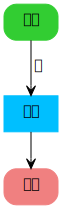

flow-lang
===
> a dsl tool based on dot drawing flowchart

#### how to use

Grammar

    START ?? TO ?? [COMMENT ??];
    IFSTEP ?? CALLED ?? TO ?? AND ??;
    STEP ?? CALLED ?? TO ?? [COMMENT ??];
    END ??;

DSL

        start a to b comment 起;
        step b called 定义 to c;
        end c;
        
=>

Picture
        

        java -Dinput=../../../resources/main/flow.fl -Doutput=./2.svg -jar flow-lang-1.0-SNAPSHOT-all.jar

#### licence

MIT

#### author

zcfrank1st / chaos